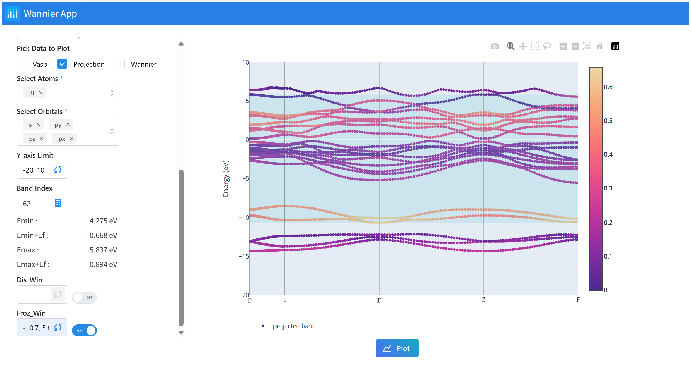

# Wannier App

## About This App

This app allows you to interactively visualize projection bands of your VASP calculation and help you better decide dis_win and froz_win parameters in wannierization using Wannier90.



## Installation

### Run it in your own environment

The app is tested in python 3.10 and the required packages is listed in `requirements.txt`. You can install them by running the following command:

```bash
pip install -r requirements.txt
```

### Using Docker

A [Docker](https://www.docker.com/) image has been built and published on Docker Hub. You can fetch the image by:

```bash
docker pull philikarus/wannier-app:0.9.3
`
```

A `run_wann_app` script is provided to help you run the app in a Docker container. You can start the container by:

```bash
run_wann_app start
```

and stop the container by:

```bash
run_wann_app stop
```

To see help information, use:

```bash
run_wann_app --help
```
